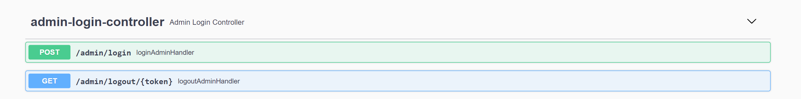
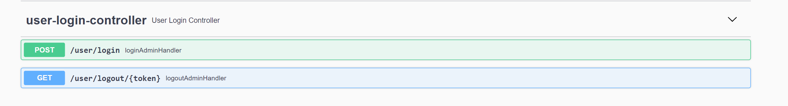
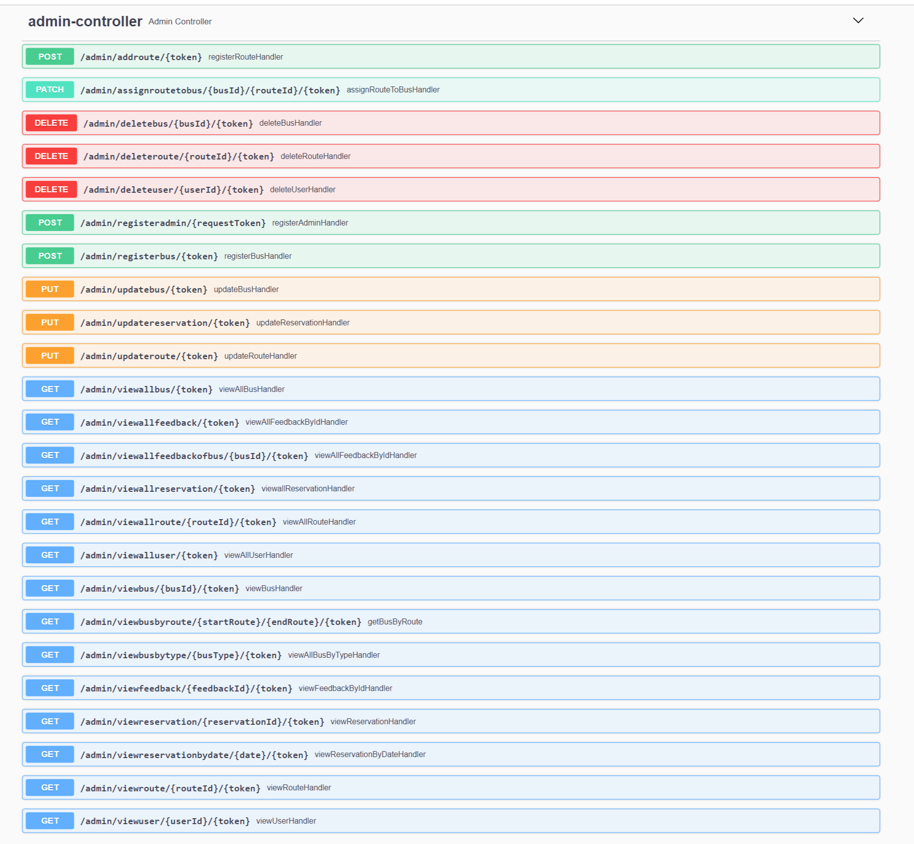
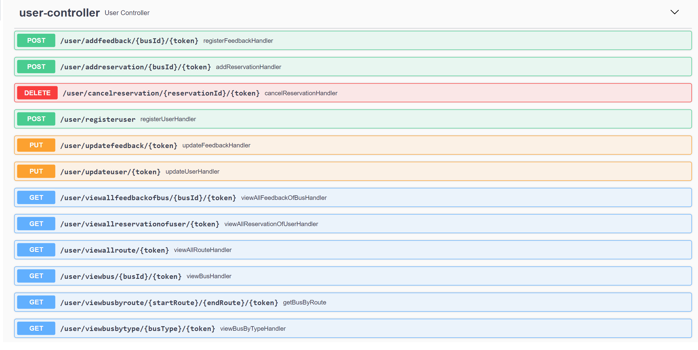

<h1>Bus Reservation System</h1>

A web service solution designed to provide customers with a personalized easy-to-utilize user experience for booking and purchasing bus tickets online.

<h2>Documentation for API</h2>

<h3>Models for post or put requests to send body of json data keyname refer below</h3>

<h4>Admin</h4>

{
"adminId": integer , // Optional for post request  but important for put request  
"email": "string",
"password": "string"
}

<h4>User</h4>

{ 
"userid": integer, // Optional for post request but important for put request 
"dateOfBirth": "YYYY-MM-DD" , 
"email": "string" , 
"firstName": "string" , 
"lastName": "string" , 
"mobile": "string" , 
"password": "string" , 
}

<h4>Route</h4>
{ 
"routeId": integer, // Optional for post request  but important for put request 
"distance" : Integer, 
"routeFrom" : "string", 
"routeTo" : "string" 
}

<h4>Bus</h4>

{ 
"busId": integer,  // Optional for post request  but important for put request  
"arrivalTime": "HH:MM:SS" ,  
"availableSeats": integer , 
"busName": "string", 
"busType": "string", 
"departureTime": "HH:MM:SS", 
"driver":  { 
"driverName": "string", 
"mobile": "string" 
}, 
"totalSeats": integer 
}

<h4>Feedback</h4>

{ 
"feedbackId": integer, // Optional for post request  but important for put request  
"comments": "string", 
"driverRating": integer, 
"feedbackDate": "2023-02-12", 
"overAllRating": integer , 
"serviceRating": integer  
}

<h4>Reservation </h4>

{ 
"reservationId": integer,  // Optional for post request  but important for put request   
"destination": "string", 
"reservationDate": "YYYY-MM-DD", 
"reservationStatus": "string", 
"reservationTime": "HH:MM:SS", 
"reservationType": "string", 
"source": "string" 
}

<h4>Admin/User Login detail for post</h4>

{ 
"email": "string", 
"password": "string" 
}

<h4> NOTE : To use the api for admin or user one should be logged in only registeration of user does not authenticate token else all APIs are authenticated via token. Note that you will be provided a TOKEN when you login with valid credentials I suggest you to save that token as that token needs to be send with api everytime;

Images of the APIs and their urls you will find type of method also and if the method is post or put you will have to send the JSON body according to the Models you are sending refer to the Models for post pr put methods.</h4>

<b>Note</b> For the API usage

API default = http://localhost:8080/admin/{busId}/{token}  // here provide busid in place of {budId} and the token you got in {token} 
resulting api example : http://localhost:8080/admin/2/mytoken

You can also change the port number from 8080 to another port number from application.properties just change server.port=8080 to another number

<h2>API Image</h2>
<h3>In the image url =  <b> /user/login which means http://localhost:8080/user/login and this goes for all the urls you will find in the image</h3>
<h3>Admin Login Controller</h3>

<h3>User Login Api</h3>

<h3>Admin Controller</h3>

<h3>User Controller</h3>

<h3>
As this project is not deployed anywhere to run this application locally follow the below steps</h3>

<b>Note</b> : Recommended to use Intellij Idea. Refer below link to download community edition free edition

<a>https://www.jetbrains.com/idea/download/#section=windows</a>

Clone this repo in your personal device, continue with the instructions below

open command prompt and follow these steps

<b>1)</b> git clone https://github.com/ShashankSinha9592/Bus_Reservation_System.git

<b>2)</b> Install MySql if you don't have refer below link to install mysql

<a>https://www.mysql.com/downloads/</a>

<b>3)</b> Open mysql and copy paste this query : <b>CREATE DATABASE busReservation; </b>

<b>4)</b> Open the file busreservationsystem from your IDE Intellij idea and follow below steps

<b>**</b> go to src/main/resources/application.properties and change the below two lines from your mysql username and password  

Note : Default username of mysql is root

Remove the curly braces{} after writing your username and password and don't put any extraspace anywhere

spring.datasource.username={YOUR USERNAME}

spring.datasource.password={YOUR PASSWORD}

Go to src/main/java/com/bus_reservation_system/demo/DemoApplication.java and run the code.

